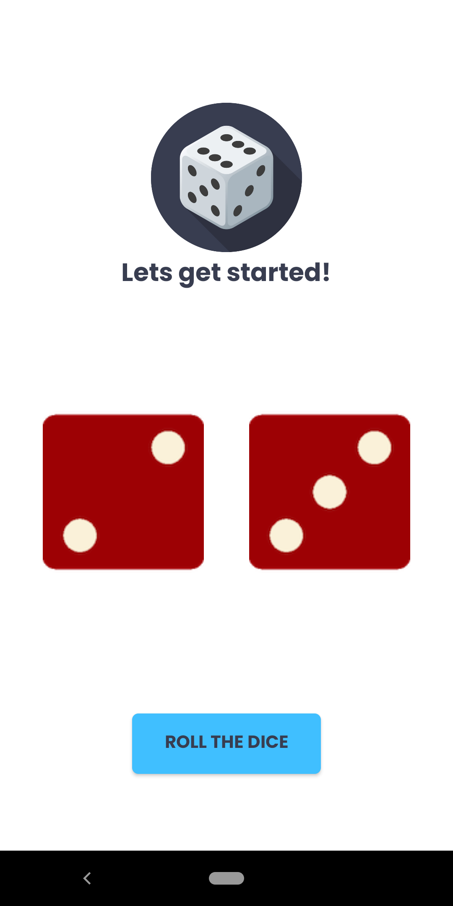

<!-- PROJECT LOGO -->
 

  

  <h3 align="center">Guess the Dice</h3>

  

    Let's play guess the dice numbers with your friends and have fun together!
     
  

<!-- TABLE OF CONTENTS -->

  
Table of Contents

  <ol>
    <li>
      <a href="#about-the-project">About The Project</a>
      <ul>
        <li><a href="#built-with">Built With</a></li>
      </ul>
    </li>
    <li>
      <a href="#getting-started">Getting Started</a>
    </li>
        <li>
      <a href="#what-i-learned">What I learned</a>
    </li>
    <li>
      <a href="#installation">Installation</a></li>
    </li>
    <li>
      <a href="#contributing">Contributing</a>
  </li>
    <li>
      <a href="#contact">Contact</a>
  </li>
  </ol>

<!-- ABOUT THE PROJECT -->
## About The Project

 

(<a href="#top">back to top</a>)

## Built With

This section should list any major frameworks/libraries used to bootstrap your project. Leave any add-ons/plugins for the acknowledgements section. Here are a few examples.

* [Java](https://www.java.com/en/)

(<a href="#top">back to top</a>)

<!-- GETTING STARTED -->
## Getting Started

Guess the Dice is an application that allows you to roll dice randomly with a random number generator. This application is suitable for playing with your friends when spending time together.

## Installation
Do these steps to run this app on your Android Studio :
1. Download this repository.
2. Extract the file in the directory you want.
3. Open the extracted folder via your android studio.

(<a href="#top">back to top</a>)

## Getting Started

In this application, I learned several things.
1. How to use splash screen on android apps.
2. How to design xml using relative layout and linear layout.
3. How to use array and random number generator.

(<a href="#top">back to top</a>)

<!-- CONTRIBUTING -->
## Contributing

Contributions are what make the open source community such an amazing place to learn, inspire, and create. Any contributions you make are **greatly appreciated**.

If you have a suggestion that would make this better, please fork the repo and create a pull request. You can also simply open an issue with the tag "enhancement".
Don't forget to give the project a star! Thanks again!

1. Fork the Project
2. Create your Feature Branch (`git checkout -b feature/AmazingFeature`)
3. Commit your Changes (`git commit -m 'Add some AmazingFeature'`)
4. Push to the Branch (`git push origin feature/AmazingFeature`)
5. Open a Pull Request

(<a href="#top">back to top</a>)

<!-- CONTACT -->
## Contact

Your Name - [@nandaiqbalh](https://instagram.com/nandaiqbalh) - nandaiqbalhanafii@gmail.com

Project Link: [https://github.com/nandaiqbalh/guess-the-dice](https://github.com/nandaiqbalh/guess-the-dice)

(<a href="#top">back to top</a>)

